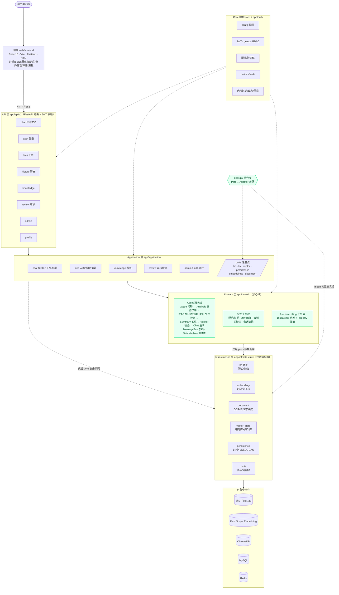
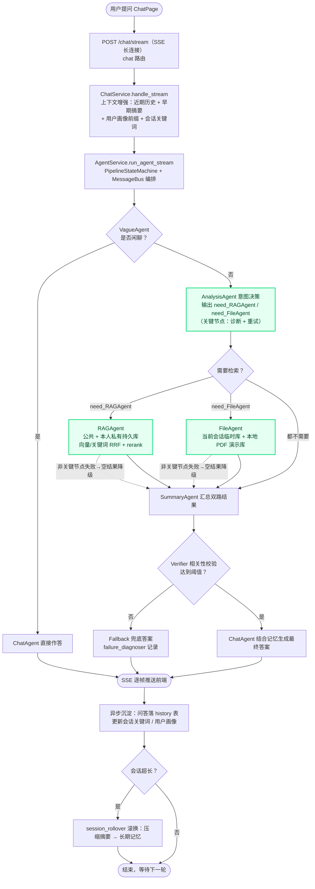
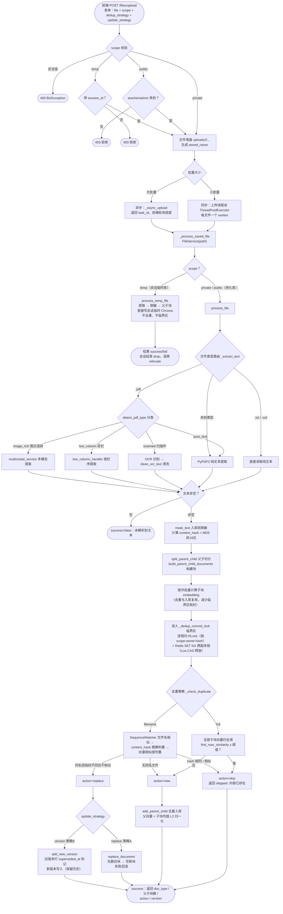
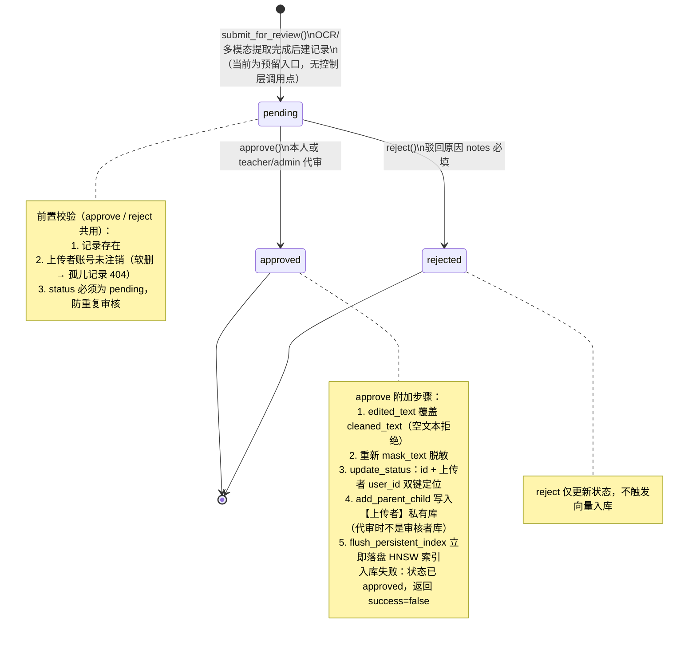

# CourseAgent 架构图与核心流程

> 本文以 Mermaid 图描述项目的分层结构、对话主流程、文件入库管线与文档审核状态机。
> 图内容基于当前代码实际实现（2026-10），可在支持 Mermaid 的 Markdown 查看器
> （Typora、VS Code Mermaid 插件、https://mermaid.live）中直接渲染。

## 1. 项目分层思维导图

依赖方向自上而下；业务层（api / application / domain / auth）只经
`app/application/ports` 访问基础设施，组合根 `app/api/deps.py` 是唯一允许
import infrastructure 的模块，在应用启动时完成 Port ↔ Adapter 装配。

## 2. 对话主流程走向（SSE 流式问答）

入口 `POST /chat/stream`：上下文增强 → 状态机编排 Agent 流水线 →
逐帧推回前端，异步沉淀历史与记忆。

关键容错：Analysis 为关键节点（诊断 + 重试）；RAG / File 为非关键节点，
失败仅降级为空结果；Verifier 校验不达标时走 Fallback 兜底。

## 3. 文件入库流程（上传 → 解析 → 去重 → 向量入库）

对应代码：`app/api/v1/files.py`（路由/线程池）、
`app/application/files/file_service.py`（解析、脱敏、去重、入库）。
去重临界区 `_dedup_commit_lock` 按 `(scope, 归属, content_hash)` 串行化
「判定 + 提交」，叠加进程锁与 Redis 跨副本锁，防 TOCTOU 重复插入。

## 4. 文档审核状态机

对应代码：`app/application/review/review_service.py`、
`app/infrastructure/persistence/repositories/document_review.py`。
三态 `pending / approved / rejected`，仅 pending 可审核；
`submit_for_review` 当前为 OCR/多模态提取后自动送审的预留入口，
尚无控制层调用点。

